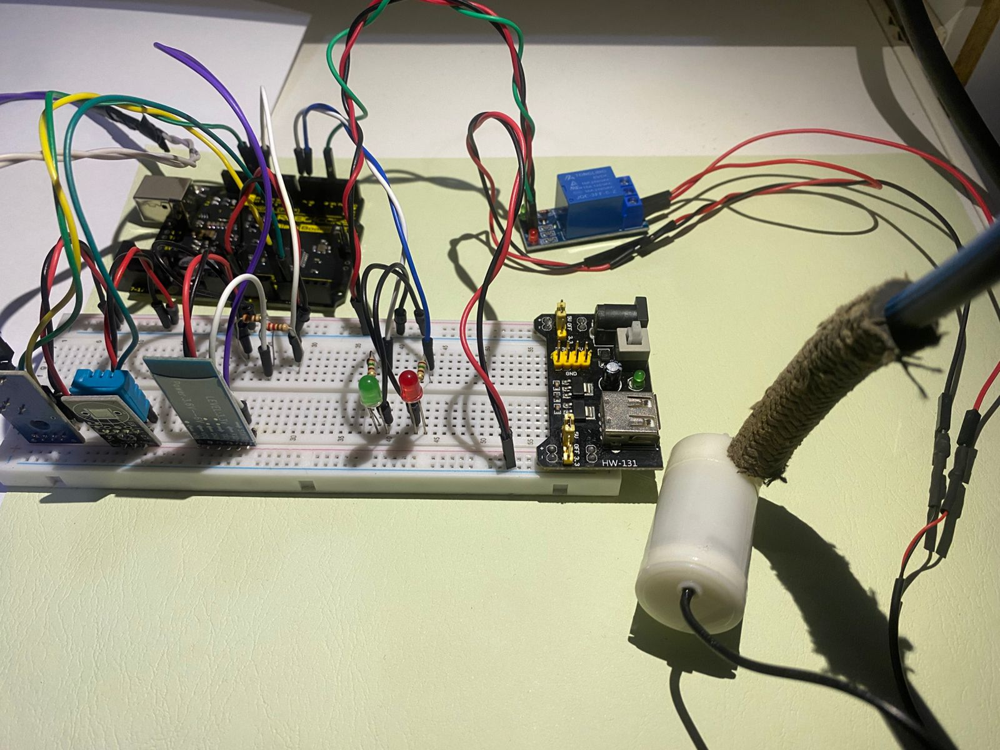
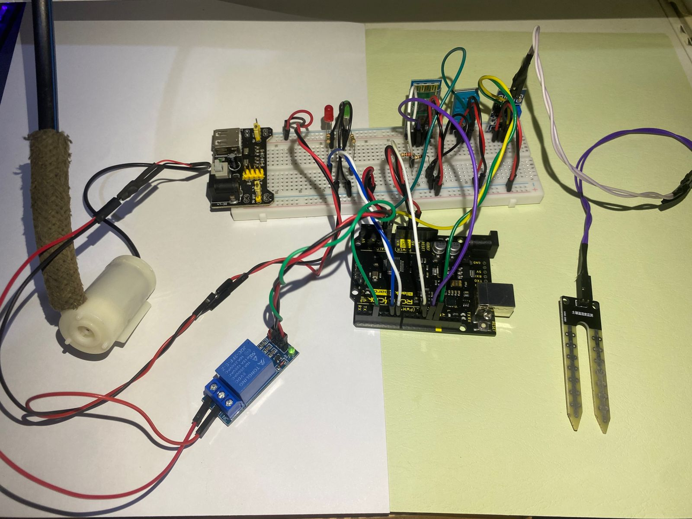

# Sistema de Irrigação Automático

## Descrição do Projeto
Este repositório contém o projeto desenvolvido para a disciplina **Infraestrutura em Ambiente IoT**, lecionada pelo professor Marcos Yuzuru de Oliveira Camada. 

**Data de início**: 1 de Outubro de 2024

## Introdução

### Objetivo
Desenvolver um sistema de irrigação automático para plantas, utilizando componentes como Sensores, Atuadores, Jumpers e uma Placa Arduino. A automação do sistema ocorre através do Sensor de Umidade de Solo, que atua como parâmetro para a ativação de uma bomba d’água submersa, responsável pela irrigação da planta.

### Descrição
Além do Sensor de Umidade de Solo, o sistema inclui outros componentes, como:
- Sensor de Temperatura e Umidade do Ambiente (DHT11)
- LEDs para indicação de estado do sistema
- Relé para ativação da bomba d’água submersa
- Módulo Bluetooth para transmissão de dados para um dispositivo móvel

## Componentes do Sistema

### Hardware
| Componente               | Função                                                                                   |
|--------------------------|------------------------------------------------------------------------------------------|
| Arduino BlackBoard UNO R3| Placa responsável pelo controle dos componentes e processamento do código.               |
| Protoboard 800 pontos    | Placa para conexão dos componentes com jumpers, sem necessidade de solda.               |
| Fonte ajustável HW131    | Fonte para ativação da bomba submersa, com tensão ajustável entre 3,3V e 5V.            |
| Módulo Bluetooth HC-05   | Módulo para transmissão de dados via Bluetooth para um dispositivo móvel.               |
| Mini Bomba d'água Submersa | Bomba responsável pela irrigação da planta, operando entre 3V e 6V.                   |
| Relé                     | Dispositivo para ativação e desativação da bomba d’água.                                |
| LEDs                     | Indicadores visuais do estado do relé e do sistema.                                     |
| Sensor de Umidade do Solo| Sensor para medição de umidade do solo, parâmetro de controle do sistema.               |
| Sensor DHT11             | Sensor para medição de umidade e temperatura do ambiente.                               |

### Softwares
- **Arduino IDE**: Ambiente de desenvolvimento para programação da placa Arduino.
- **Serial Bluetooth Terminal**: Aplicativo móvel para conexão com o Módulo HC-05 e recebimento dos dados dos sensores.

### Materiais Auxiliares
- Jumpers (Macho-Macho, Fêmea-Fêmea, Macho-Fêmea)
- Resistores de 150Ω, 220Ω e 330Ω
- Mangueira

## Arquitetura e Conexões
- **DHT11** – Saída no pino A1
- **Sensor de Umidade do Solo** – Saídas nos pinos A0 e D13
- **HC-05** – RXD no pino D11, TXD no pino D12
- **LEDs** – Saídas nos pinos D6 e D7
- **Relé** – Saída no pino D3
- **Bomba d’água** – VCC na entrada NO do Relé, GND na fila – da protoboard

## Imagens do Sistema

> **Nota**: A bomba d’água opera submersa. Para a foto do circuito, ela foi removida da água.

## Funcionamento do Sistema

### Primeiros Passos
1. Quando o sistema é ligado, o Módulo Bluetooth HC-05 é ativado, permitindo a conexão com um dispositivo móvel.
2. Após a conexão, faça o upload do código para a placa Arduino. Isso exibirá uma mensagem de introdução no terminal Bluetooth:
"Projeto automático de irrigação de uma planta – Título do projeto
DHT11 e Sensor de Umidade do Solo – Sensores que servirão de parâmetros"

### Operação do Sistema
1. O Sensor de Umidade do Solo coleta os valores do solo com sua sonda ("Dentes"), determinando se o solo está seco ou úmido.
- Se o valor for **<= 600**, o solo está **úmido** e o relé será **DESLIGADO**, exibindo a mensagem:
  Solo úmido - Relé DESLIGADO
- Se o valor for **> 600**, o solo está **seco** e o relé será **LIGADO**, exibindo a mensagem:
  Solo seco - Relé LIGADO

### Sensor DHT11
Além de indicar o estado de umidade do solo e do relé, o sistema transmite os dados de umidade e temperatura do ambiente, coletados pelo Sensor DHT11, para o terminal Bluetooth. A mensagem exibida será:
"Umidade: xx.xx%
Temperatura: xx.xx°C"

### LEDs
Os LEDs atuam como indicadores visuais do sistema:
- Quando o sistema estiver desligado (solo úmido), um LED vermelho será aceso.
- Quando o sistema estiver ligado (solo seco), um LED verde será aceso.
